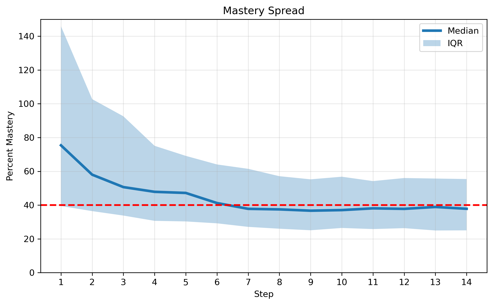
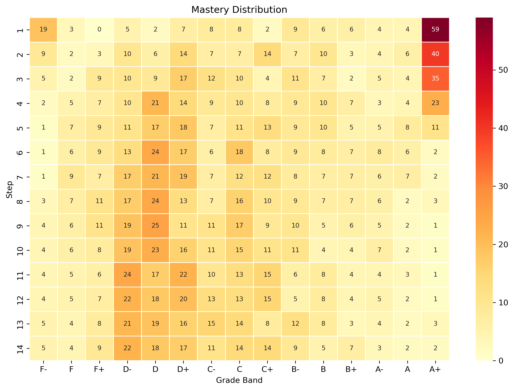
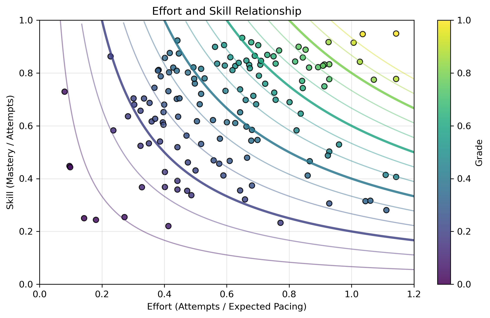
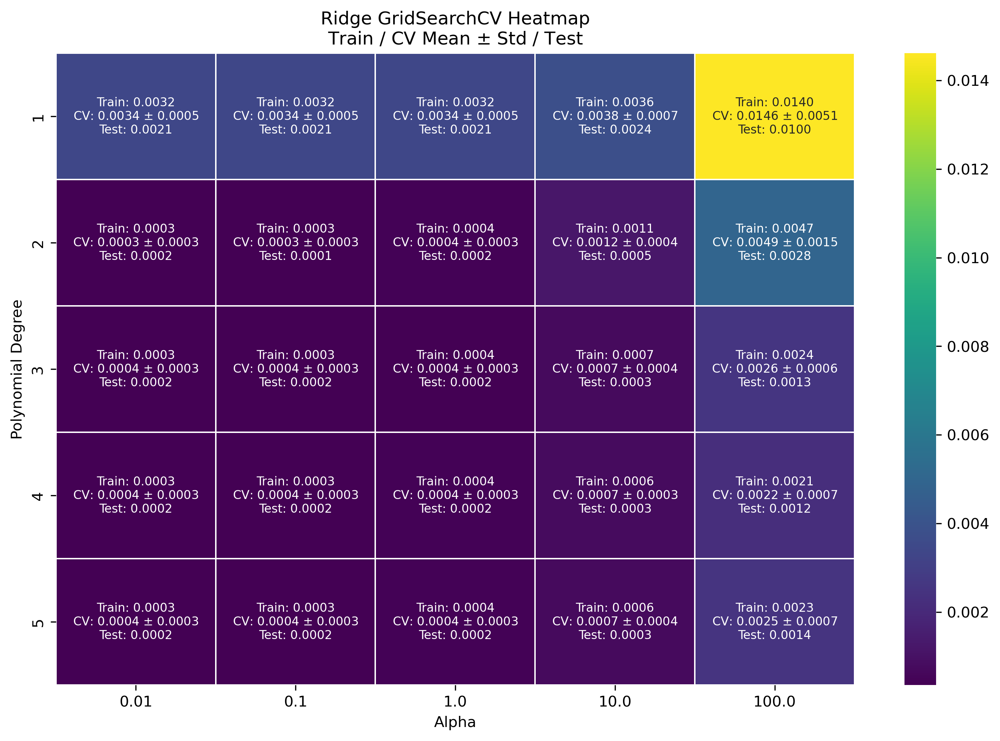
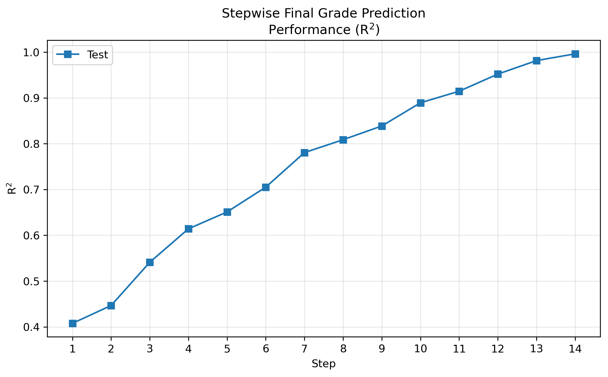
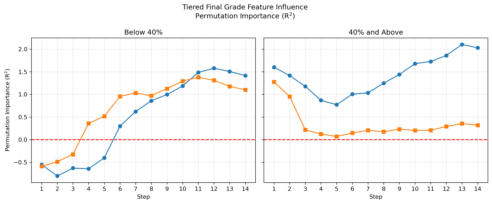

# Capstone Project
## Early Signal Emergence in Effort, Skill, and Mastery

## Overview
This project investigates whether meaningful signals about student performance emerge before final course completion.

Using longitudinal assessment data, the analysis combines exploratory data analysis (EDA) and predictive modeling to examine how effort, skill, and mastery evolve.

The goal is to determine whether early patterns in student behavior can help inform earlier and more effective instructional interventions.

---

## Dataset
The dataset consists of longitudinal assessment records capturing student performance across multiple instructional steps, including:

- Stepwise attempt counts (`new_attempts_step_i`)
- Stepwise accuracy measures (`new_accuracy_step_i`)
- Outcome categories (wrong, quarter, half, full credit)
- Revision behavior (corrections, regressions, laterals)

The data is structured to track performance over multiple instructional steps.

---

## Exploratory Data Analysis (EDA)
EDA examines structural patterns in student learning behavior.

Key analyses include:

- Distribution of new work outcomes
- Distribution of revisions
- Mastery growth over time
- Mastery distribution across grade bands
- Relationship between effort and skill
- Stepwise correlations with final outcomes

### Key EDA Findings
- First-attempt outcomes are dominated by full credit, with meaningful partial credit structure.
- Revision behavior is primarily corrective.
- Mastery distribution begins to stabilize around Step 7 (mid-course).
- Effort and skill define multiple pathways to similar outcomes.
- Correlation structure suggests effort becomes increasingly important over time.

---

## Modeling Approach
Ridge regression with polynomial features is used to evaluate predictive signal over time.

Modeling includes:
- Cross-validated model selection (GridSearchCV)
- Stepwise prediction performance (R²)
- Permutation importance for feature influence
- Tiered analysis by performance level

---

## Key Modeling Findings
- Predictive signal emerges early and strengthens steadily over time.
- By approximately Step 7, a large portion of outcome variance is explained. 
- Effort and skill begin similarly but diverge, with effort becoming more influential.
- Signal emergence differs across performance tiers.

---

## Conclusion
This project shows that student assessment data contains meaningful early signals of performance.

Key takeaways:
- Learning structure becomes visible before final outcomes.
- Effort plays an increasingly important role over time.
- Different performance groups exhibit different signal patterns.

These findings suggest clear value in earlier and more targeted instructional interventions.

---

## Key Visualizations

### Exploratory Data Analysis

#### Mastery Spread

Median mastery approaches the 40% threshold near Step 7, suggesting a midpoint transition in aggregate performance. The persistent spread indicates substantial variation in student trajectories.

 

#### Mastery Distribution

Grade-band structure stabilizes around Step 7, with the overall distribution taking shape well before the final steps. This indicates that performance patterns emerge earlier than final outcomes alone might suggest.

 

#### Effort and Skill Relationship

Effort and skill define multiple pathways to similar outcomes. The geometry highlights that higher performance requires strong alignment between both factors. 

 

### Modeling

#### Ridge Model Selection

Cross-validation results indicate that low-degree polynomial features with moderate regularization provide the best balance between fit and stability.

 

#### Stepwise Prediction Performance (R²)

Predictive performance improves steadily over time, with strong explanatory power emerging by approximately Step 7 and continuing to increase thereafter.

 

#### Tiered Feature Influence

Feature influence differs across performance tiers, with effort showing stronger separation in higher-performing groups and less distinction among lower-performing students.